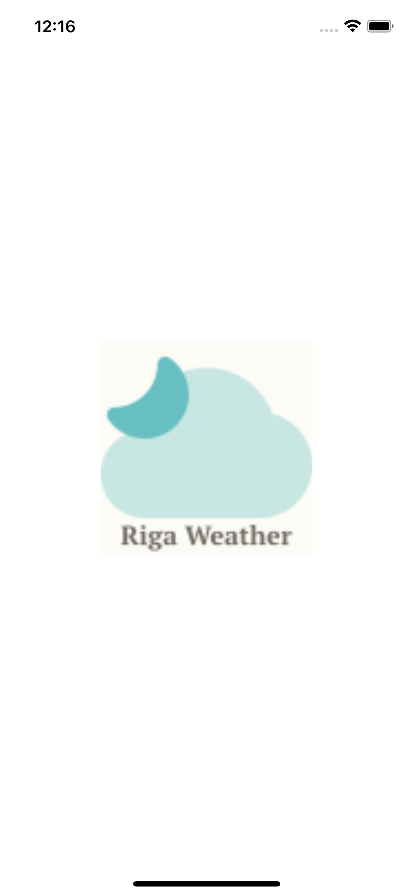
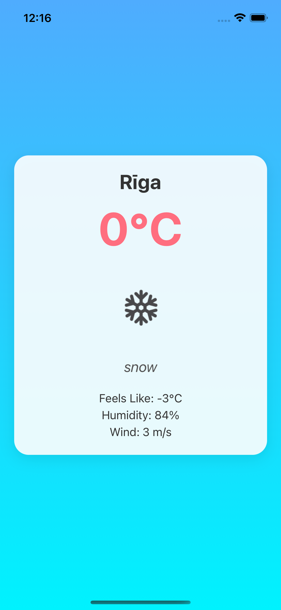

# Riga Weather

Riga Weather is a mobile application built with **React Native** and **Expo**. The app fetches live weather data for Riga using the **OpenWeatherMap API** and displays it in a clean and modern interface. It is designed to work seamlessly on both iOS and Android platforms.

---

## **Features**
- Displays current weather data for Riga, including:
  - Temperature
  - Feels like temperature
  - Humidity
  - Wind
- Beautiful splash screen and easy-to-read UI.

---

## **Screenshots**
### 1. Splash Page


### 2. Weather Page


---

## **Installation**
Follow the steps below to run the app locally:

### Prerequisites
- Node.js installed on your machine.
- `npm` or `yarn` installed.
- Expo CLI installed globally:
  ```bash
  npm install -g expo-cli
